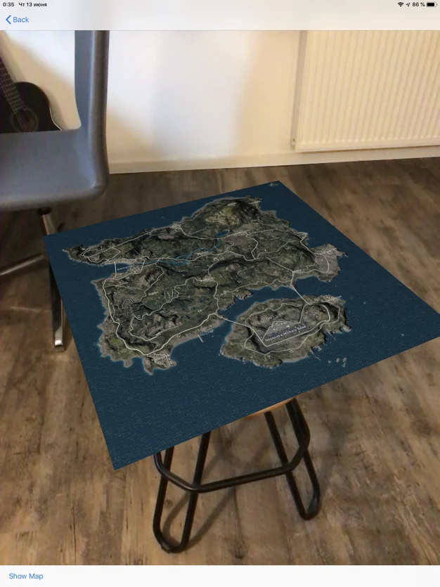

# AR-Match-Replays-for-PUBG

Author Tran Giang Long

`AR-Match-Replays-for-PUBG` is an AR application for showing a replay PUBG match. 

The map is builded by using a normal map and a height map file in `/assets/Map`. The normal map represents a satellite view. The height map allows us to know how high is ground at the position. If you open the height map in any image view application, you can see that the image is just grey. The reason is that the height was encoded in rgb channel. For example, the height at the position (x, y) is (r, g, b), where r = g = b. Each position of the map will be builded in 3 dimensional space. After that I connect all those point into a set of small triangles. The last step is doing a UV mapping to connect normal map and a height map. As the result I get a map with relief.

More detail about building the map you can see in the `MapFactory` class. 

For getting a replay data I use API endpoints at `https://developer.pubg.com`. The data is a sequence of actions. 
Using `SceneKit` I connect the actions from timeline and the nodes in scene.

Example: Move player 1 to (x,y) -> Player 1 picks a weapon -> Player 1 was killed -> and so on... 

AR Match Replays for PUBG is a third-party application. This application is in no way sponsored, endorsed or administered by, or associated with Bluehole, PUBG Corporation or Tencent Games.

## Links
Appstore: https://apps.apple.com/de/app/ar-match-replays-for-pubg/id1467986281

## Screenshots 

